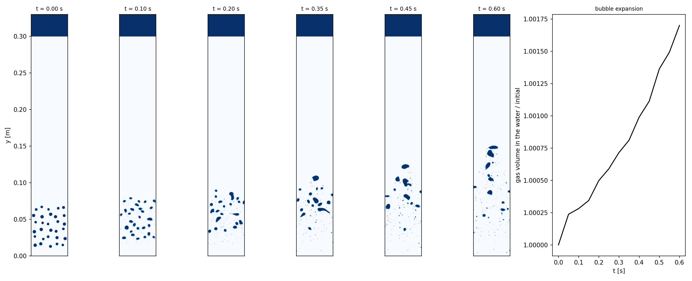

# Bubble Column (2D, all-Mach pressure projection)

A swarm of air bubbles rises through a water column and bursts into an air headspace. Both phases are compressible with
the properties of water and air at 20 C (water a stiffened gas, air an ideal gas; density ratio ~830 at 1 atm), so each
bubble expands as the hydrostatic pressure falls on its way up. That expansion, a factor p_bottom/p_top over the
column, is what incompressible bubbly-flow solvers leave out, and it grows with depth: 3% at the default 0.3 m, a factor
2 at 10 m. The flow Mach number in the water is ~1e-4, so the projection steps at the flow's and the capillary pace
where an explicit solver must resolve the 1450 m/s sound speed.

```shell
./mfc.sh run examples/2D_bubble_column/case.py --case-optimization -- --tstop 0.6
python3 examples/2D_bubble_column/snapshots.py examples/2D_bubble_column --out result.png
```



The first 0.6 s at the defaults: 264k cells, 18,400 steps (capillary-limited, dt ~ 3e-5 s), 32 min on one A100.

`--cols`/`--rows` set the bubble count, `--d` their mean diameter, `--spread` the spread of their sizes, `--depth` and
`--p-top` the column, and `--ppd` the cells per diameter. The bubbles start on a jittered lattice, each moved and resized
by a hash of its lattice cell (`--seed`), so the initial condition is a single analytic patch however many there are.
`--single` instead places one bubble of diameter `--d` at the centre of a column `--spacing` diameters wide, a check of
its expansion against the adiabatic law.

Limitations: the gas expands adiabatically (no heat conduction), where millimetre bubbles rising this slowly are close
to isothermal; in 2D each bubble is a cylinder; and at 16 cells per diameter the thin films between bubbles drain
numerically, so close bubbles coalesce sooner than they physically would.
