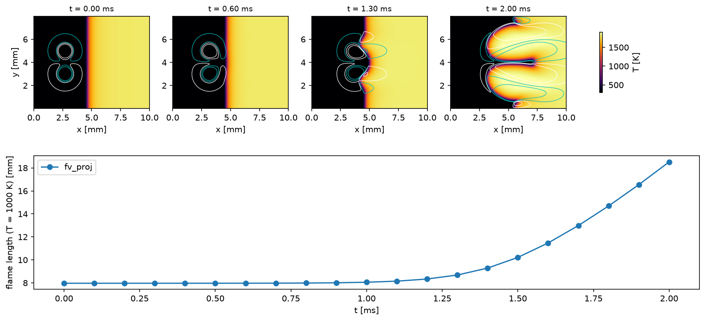

# Premixed Flame-Vortex Interaction (2D, all-Mach pressure projection)

A lean hydrogen-air flame (`h2o2.yaml`, 300 K to 1800 K), steady in a 0.77 m/s inflow, is struck by a counter-rotating vortex
pair that drives a pocket of fresh gas into it. The flame and vortices are those of `examples/2D_premixed_flame_vortex`
(`hcid` 271) at half its resolution (512 x 256 cells, ~12 across the flame): `IC/` holds that example's steady 1D flame
interpolated to this grid. Fresh gas enters through a Dirichlet (-17) inlet and leaves through a pressure outlet at 1 atm (an
extrapolation boundary with `bc_x%pres_out`); y is periodic. Diffusion is mixture-averaged and the reactions operator-split,
the projection's only reaction mode, in which the next pressure solve turns each cell's constant-volume heat release into
expansion.

```shell
./mfc.sh run examples/2D_flame_vortex_projection/case.py --case-optimization
python3 examples/2D_flame_vortex_projection/analyze.py examples/2D_flame_vortex_projection --out result.png
```



The vortex pair carries fresh gas through the flame and folds it into a mushroom, stretching the flame (the T = 1000 K contour)
from 8.0 to 18.5 mm by 2 ms. Away from the vortices the flame stays where the inflow holds it, drifting 0.02 m/s (2.5% of the
flame speed) over the first millisecond.

The flow Mach number is ~5e-3, yet the step here is set by the explicit diffusion of the hot burned gas, not by its flow: the
run takes 23,000 steps (11 min on one A100) at an acoustic CFL of ~3, against ~115,000 for the explicit solver (`--explicit`,
~30 min at its lower cost per step), a 2.7x saving. Without molecular transport the same case steps at the flow's pace, at an
acoustic CFL of 170 (424 steps); implicit diffusion would bring that to the transported flame.

Limitations: diffusion and viscosity are explicit and set the time step at flame-resolving grids; and the reactions couple to
the expansion one step late (first-order operator splitting), which for a 1D stoichiometric hydrogen-air flame at 25 um
still gives the laminar flame speed within 0.3% of Cantera's.
