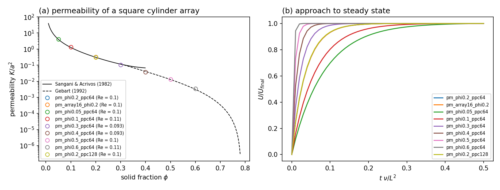

# Porous Medium: Flow Through a Cylinder Array (2D, all-Mach pressure projection)

Pressure-driven Stokes flow through a periodic square array of cylinders, the canonical model of a fibrous porous
medium. Each unit cell holds a no-slip cylinder, a stationary immersed boundary; a uniform body force stands in for the
mean pressure gradient, and the steady superficial velocity gives the permeability K. `--nx`/`--ny` set the number of
cylinders, `--phi` the solid fraction, `--Re` the target Reynolds number, and `--jitter` moves each cylinder within its
cell for a disordered medium.

```shell
./mfc.sh run examples/2D_porous_cylinder_array/case.py --case-optimization -- --nx 16 --ny 16 --phi 0.2
python3 examples/2D_porous_cylinder_array/analyze.py examples/2D_porous_cylinder_array --plot result.png
```

The step is viscous-limited (the explicit viscous term needs `--cfl` below ~0.3 in 2D). The flow reaches steady state
within about half a viscous time L^2/nu; `analyze.py` reports the remaining drift of U.

## Permeability against the references (Re = 0.1, 64 cells per unit cell)



| phi  | K/a^2  | reference                      | difference |
|------|--------|--------------------------------|------------|
| 0.05 | 4.156  | 4.040 (Sangani & Acrivos 1982) | +2.9%      |
| 0.1  | 1.344  | 1.266                          | +6.1%      |
| 0.2  | 0.3191 | 0.3094                         | +3.1% (+1.4% at 128 cells) |
| 0.3  | 0.1073 | 0.1160                         | -7.5%      |
| 0.4  | 0.0379 | 0.0408 (Gebart 1992)           | -7.0%      |
| 0.5  | 0.0131 | 0.0129                         | +1.4%      |
| 0.6  | 0.0035 | 0.0032                         | +11% (8-cell gap) |

Sangani & Acrivos's expansion holds at low solid fraction and Gebart's lubrication form near contact; neither is exact
near phi = 0.3-0.4. The 16 x 16 array (256 cylinders, 1024^2 cells, ~5 min on one A100) gives the single cell's
permeability to four digits, as periodicity requires.
