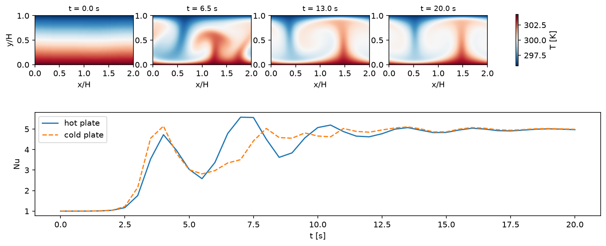

# Rayleigh-Bénard Convection (2D, all-Mach pressure projection)

Air between a hot lower plate and a cold upper plate, 5 cm apart and periodic over two plate gaps. The plates are no-slip
isothermal walls (`bc_y%isothermal_in/out`); heat crosses the gap by Fourier conduction (`fluid_pp(1)%k_therm`), which under the
projection enters the pressure equation, and buoyancy is the gravity body force on the density the heating lowers. The air
starts in the conduction profile with a 1% temperature perturbation. `--Ra` and `--Pr` set the plate temperature difference and
the conductivity (air's viscosity throughout).

```shell
./mfc.sh run examples/2D_rayleigh_benard_projection/case.py --case-optimization
python3 examples/2D_rayleigh_benard_projection/analyze.py examples/2D_rayleigh_benard_projection --out result.png
```

At the defaults, Ra = 1e5 and Pr = 0.71 (dT = 8.5 K), the flow Mach number is ~3e-4. The projection steps at the pace of the
conduction and the flow, so the run (256 x 128 cells, 20 s) takes 16,600 steps, 8 min on one A100; the explicit solver, held to
the 347 m/s sound speed, would take ~3e7.



The perturbation grows into a single pair of counter-rotating rolls, hot fluid rising at one plume and cold sinking at the
other. Nu, the plates' heat flux over the conductive k dT/H, settles at 4.94; at Ra = 1.2e5 it varies by 0.3% from 64 to
128 cells across the gap. The hot and cold plates differ while the mean temperature relaxes, over the thermal time H^2/kappa ~ 110 s,
and the domain's energy change matches that difference.

Verification: at Pr = 7 and Ra = 4e4 (`--Pr 7 --Ra 4e4 --ny 64 --tstop 300`) the rolls reach a steady Nu = 3.68 at both plates,
on the steady primary branch of Waleffe, Boonkasame & Smith, Phys. Fluids 27, 051702 (2015), Fig. 1 (~3.7 at L/H = 2).

Limitations: the Boussinesq reference is approached only for dT << T0 (3% at the defaults); and the explicit conduction and
viscosity set the time step, which scales as the square of the cell size.
